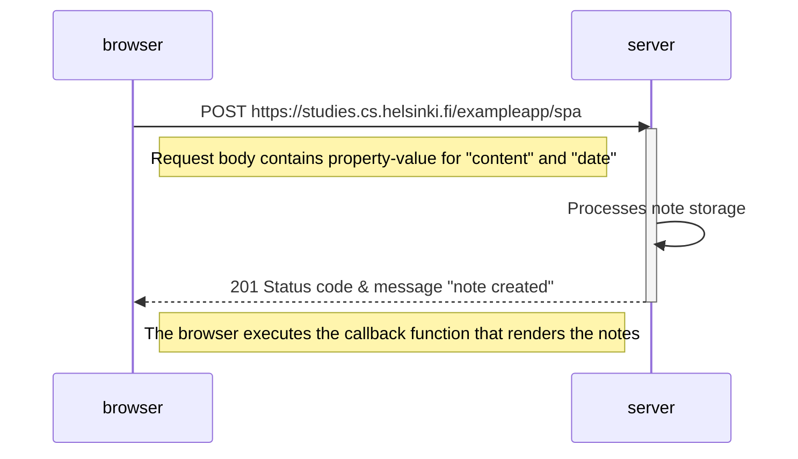

```mermaid
    sequenceDiagram
        participant browser
        participant server

        browser->>server: POST https://studies.cs.helsinki.fi/exampleapp/spa
        activate server
        Note right of browser: Request body contains property-value for "content" and "date"
        server->>server: Processes note storage
        server-->>browser: 201 Status code & message "note created"
        deactivate server

        Note right of browser: The browser executes the callback function that renders the notes
```